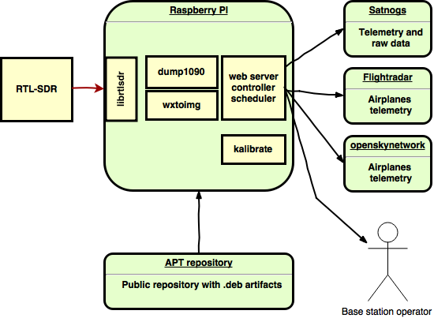

# About [](https://travis-ci.org/dernasherbrezon/r2cloud)

r2cloud converts Raspberry PI into the base station which supports various radio signals, such as:

 - ADS-B (airplane)
 - APT (weather satellite)
 - 2FSK telemetry demodulation for various cubesats
 
# Principal diagram



# Installation

1. Insert SD card into the card reader and create file ```r2cloud.txt``` in the root directory. This file should contain any random string. This string is a login token. This token will be used during initial setup.

2. Login via SSH and execute the following commands:

```
sudo bash -c "echo 'deb [arch=armhf] http://s3.amazonaws.com/r2cloud r2cloud main' > /etc/apt/sources.list.d/r2cloud.list"
sudo apt-get update
sudo apt-get install r2cloud
```

# Design guidelines

 - Autonomous:
   * Ability to operate without internet connection
   * synchronize state once connection restored
   * automatically calibrate average absolute error
   * configure base station location based on coordinates from GPS receiver
   * new decoders could be added after auto-update
 - Integration with external systems:
   * share as much as possible data with external systems
   * re-use libraries
 - Single stack
   * focus on single hardware and software stack
   * optimize it
 - Stability
   * housekeeping logs and data based on available hard disk
   * auto-update
   * backward compatibility
 - Security
   * safe to expose administration UI to the internet
   
Details could be found in official [documentation](https://github.com/dernasherbrezon/r2cloud/wiki/Features).

# Contribution

Please read our [guidelines](https://github.com/dernasherbrezon/r2cloud/wiki/Contribution).
