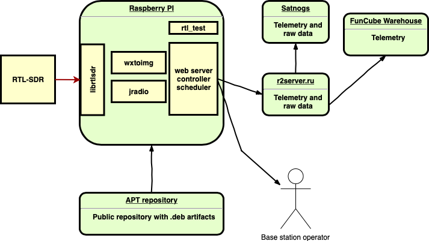

# About [](https://travis-ci.org/dernasherbrezon/r2cloud) [](https://codecov.io/gh/dernasherbrezon/r2cloud) [](https://snyk.io/test/github/dernasherbrezon/r2cloud) [](https://gitter.im/r2cloud/Lobby)

r2cloud converts Raspberry PI into the base station which supports various radio signals, such as:

 - ADS-B (airplane)
 - APT (weather satellite)
 
# Screenshots ([r2cloud-ui](https://github.com/dernasherbrezon/r2cloud-ui))

&nbsp;&nbsp;&nbsp;
 
# Principal diagram 



# Installation 

There are 2 ways to install r2cloud:

1. From the image. This is simpliest way and require brand new SD card

  - Download the [latest](https://s3.amazonaws.com/r2cloud/dist/image_2017-09-09-r2cloud-lite.zip) official image
  - Insert SD card into the card reader and flash it. You could use [Etcher](https://etcher.io) to do this
  
2. From repository binaries. Use this way if you have something already installed on SD card.
  - Login via SSH and execute the following commands:
```
curl -s https://packagecloud.io/install/repositories/dernasherbrezon/r2cloud/script.deb.sh | sudo bash
sudo apt-get install r2cloud
```

Insert SD card into the card reader and create file ```r2cloud.txt``` in the root directory. This file should contain any random string. This string is a login token. This token will be used during initial setup.

Insert SD card into the RPi and open [http://raspberrypi](http://raspberrypi) address.

# Design guidelines

 - Autonomous:
   * Ability to operate without internet connection
   * synchronize state once connection restored
   * automatically calibrate average absolute error
   * configure base station location based on coordinates from GPS receiver
   * new decoders could be added after auto-update
 - Integration with external systems:
   * share as much as possible data with external systems
   * re-use libraries
 - Single stack
   * focus on single hardware and software stack
   * optimize it
 - Stability
   * housekeeping logs and data based on available hard disk
   * auto-update
   * backward compatibility
 - Security
   * safe to expose administration UI to the internet
   
Details could be found in official [documentation](https://github.com/dernasherbrezon/r2cloud/wiki/Features).

# Contribution

Please read our [guidelines](https://github.com/dernasherbrezon/r2cloud/wiki/Contribution).

# Contact

Please use [gitter](https://gitter.im/r2cloud/Lobby)